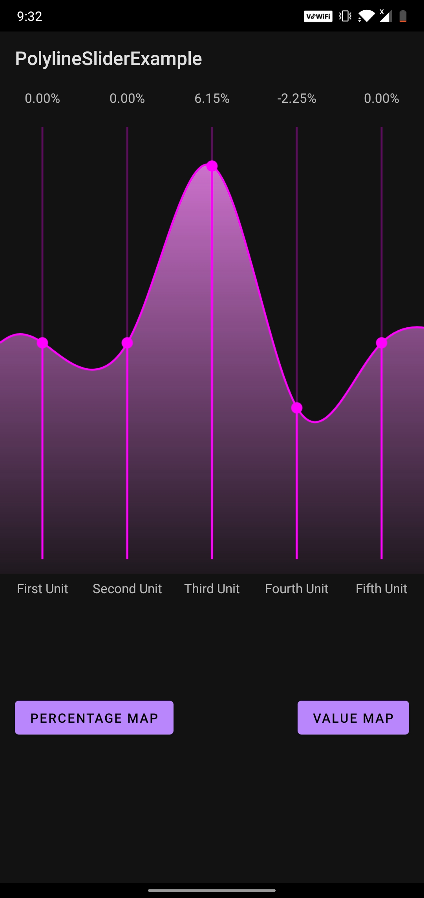
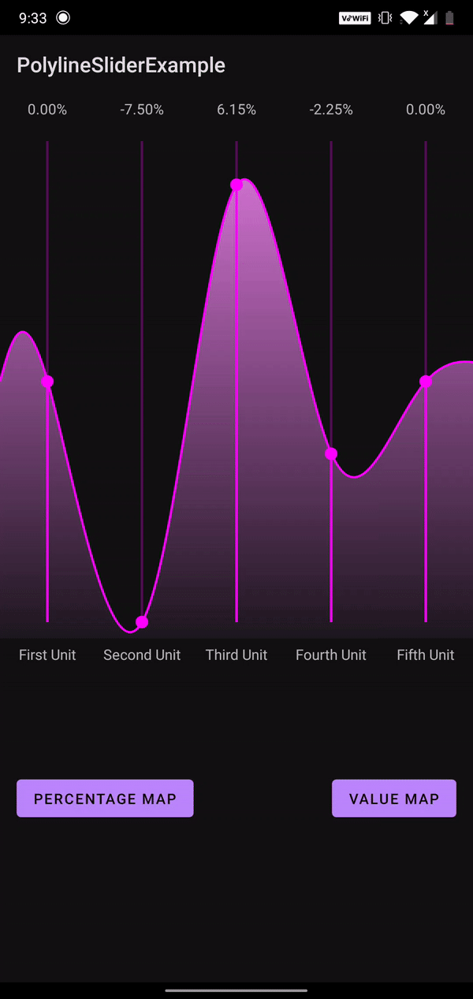

# PolylineSlider[WIP]
Polyline Slider is an Android View Library aiming to improve capturing range-based inputs, such as those in Music Equalizers.

# API
To be added in the coming weeks.

# Features
- Custom X and Y Axis Units
- Ability to change the color of the sliders and their thumbs
- Ability to hide slider track
- Obtaining real-time changes in the positions of the thumbs using listeners [WIP]

# Images and GIFs
The following depict how the libarary will look and how one can interact with it. (More screenshots will be added soon!)

